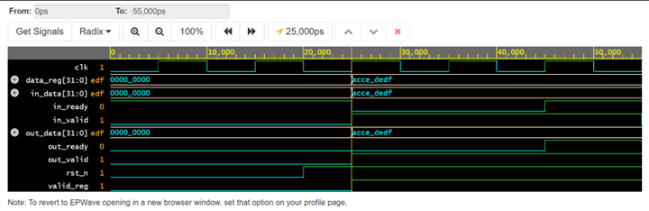
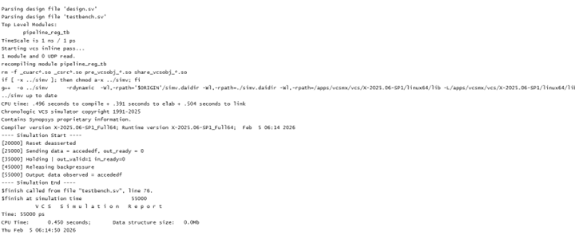

# optoML Task — Single-Stage Pipeline Register (SystemVerilog)

RTL design task submitted for the **optoML ASIC/RTL Design Engineer Internship** position. Implements a single-stage pipeline register with a standard valid/ready handshake in SystemVerilog.

---

## Problem Statement

> Implement a single-stage pipeline register in SystemVerilog using a standard valid/ready handshake. The module sits between an input and output interface, accepts data when `in_valid` and `in_ready` are both asserted, presents stored data on the output with `out_valid`, and correctly handles backpressure without data loss or duplication. The design must be fully synthesizable and reset to a clean, empty state.

---

## Design Overview

A pipeline register is a fundamental building block in pipelined digital systems. This implementation acts as a **1-entry elastic buffer** using the AXI-style valid/ready handshake protocol.

### Handshake Rules

```
Transfer occurs when:   in_valid  AND  in_ready  are BOTH high (at input side)
Data outputs when:      out_valid is high
Backpressure applied:   in_ready goes LOW when the register is full and output is not accepted
```

### State Machine

```
         ┌─────────────────────────────────┐
         │            EMPTY                │◀──── rst
         │  in_ready=1, out_valid=0        │
         └──────────────┬──────────────────┘
                        │ in_valid (data accepted)
                        â–¼
         ┌─────────────────────────────────┐
         │            FULL                 │
         │  in_ready=0*, out_valid=1       │
         └──────────────┬──────────────────┘
                        │ out_ready (downstream accepts)
                        â–¼
                   back to EMPTY
                   (or accept next data if in_valid)
```

> *`in_ready` can be 1 in FULL state if the output is being accepted simultaneously (zero-bubble throughput).

---

## File Structure

```
optoML_task/
├── README.md
├── Problem Statement          ← Original task brief (rename to Problem_Statement.txt)
├── RTL_Design/
│   ├── single_stage_pipeline_reg.sv   ← RTL design (SystemVerilog)
│   └── pipeline_reg_tb.sv             ← Testbench with valid/ready scenarios
├── output_waveform.png        ← Simulation waveform screenshot
├── console_log_display.png    ← Console output from simulation
└── schematic_pipeline_reg.pdf ← Synthesized schematic from EDA tool
```

---

## Port Description

| Port | Direction | Width | Description |
|------|-----------|-------|-------------|
| `clk` | input | 1 | System clock (posedge triggered) |
| `rst_n` | input | 1 | Active-low synchronous reset |
| `in_valid` | input | 1 | Upstream data valid |
| `in_ready` | output | 1 | Module ready to accept data |
| `in_data` | input | N | Input data bus |
| `out_valid` | output | 1 | Downstream data valid |
| `out_ready` | input | 1 | Downstream ready to accept |
| `out_data` | output | N | Output data bus |

---

## Simulation Results

The testbench covers the following scenarios:

| Test Case | Description |
|-----------|-------------|
| Normal transfer | `in_valid=1`, `out_ready=1` — data flows through in 1 cycle |
| Backpressure | `out_ready=0` — register holds data, `in_ready` deasserts |
| Back-to-back | Continuous valid data with always-ready downstream |
| Reset behaviour | `rst_n=0` — clears register, `out_valid` goes low |

### Waveform


### Console Log


### Synthesized Schematic
See `schematic_pipeline_reg.pdf` for the gate-level view.

---

## Online Simulation

The EDA Playground implementation is available here:  
[https://www.edaplayground.com/x/uQTR](https://www.edaplayground.com/x/uQTR)

---

## Tools Used

| Tool | Purpose |
|------|---------|
| SystemVerilog | RTL and Testbench |
| EDA Playground (Aldec Riviera-PRO) | Simulation |
| Synthesis tool | Schematic generation |

---

## What to Add Next

- [ ] Rename `Problem Statement` file → `Problem_Statement.txt`
- [ ] Add `docs/` folder with a timing diagram image
- [ ] Set GitHub topics: `systemverilog` `pipeline-register` `rtl-design` `asic` `valid-ready-handshake` `internship`

---

## License

MIT License
